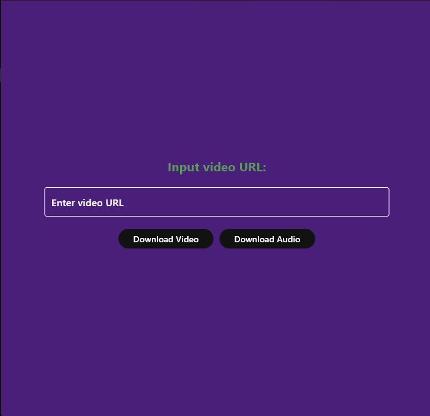
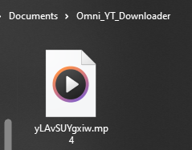

# YouTube Downloader

A simple YouTube downloader made with Flutter that allows users to download either video-only or audio-only from a YouTube link. This project was completed for a client but contributions are welcome!

---

## Features
- Download video-only or audio-only from YouTube.
- Uses `youtube_explode_dart` for extracting and downloading media.
- Simple and easy-to-use interface.

---

## Tech Stack
- **Flutter**: Cross-platform UI development
- **Dart**: Programming language
- **youtube_explode_dart**: Library for fetching and downloading YouTube media

---

## Screenshots

| YT Downloader | Output (Documents directory) |
|---------------|------------------------------|
|  |  |

## Installation
1. Clone the repository:
   ```sh
   git clone https://github.com/wuxnz/flutter_ytdl.git
   cd flutter_ytdl
   ```
2. Install dependencies:
   ```sh
   flutter pub get
   ```
3. Run the app:
   ```sh
   flutter run
   ```

## Usage
1. Enter the YouTube video link.
2. Choose whether to download video-only or audio-only.
3. Click the download button and wait for the process to complete.

## Contributions
Although this project was completed for a client, contributions to improve functionality, UI, or performance are welcome! Feel free to submit a pull request.

## License
This project is open-source and available under the MIT License.

